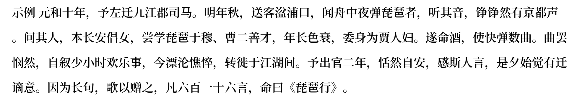

# 小米便签导出工具

## 功能

该代码可以将Json格式的小米便签导出为docx文档和png图片。

## 使用方法

1. 导出小米便签为notes.json，参考[如何让小米便签在电脑上导出？ - 知乎 (zhihu.com)](https://www.zhihu.com/question/35329107/answer/2726573615)
2. 将notes.json复制到项目文件夹中，在项目文件夹的命令行工具（如windows powershell）中输入 `python main.py`
3. 查看项目文件夹中的docx和png文件

## 结果

### docx

[示例.docx](./示例.docx)

### png

字体为google fonts的Noto Serif Simplified Chinese



## 使用要求

- Python
- 安装了json、Pillow、docx库。可以通过运行以下命令进行安装：

```shell
pip install json
pip install pillow
pip install python-docx
```

## 注意事项

- 笔记标题为空或者包含“-”会导致无法保存

  